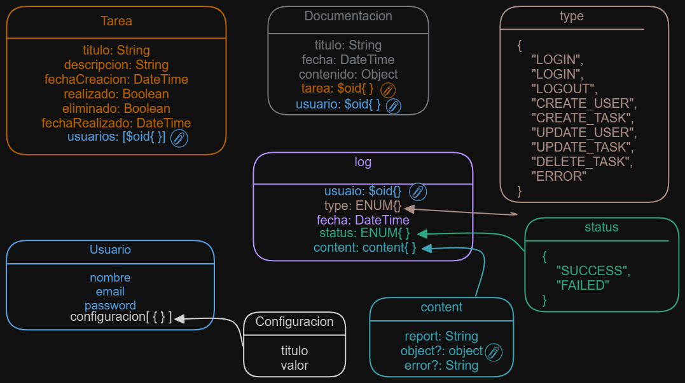

# Inicio
## Introducción
Servdor Web mediante:

### BackEnd
Servidor Node.Js usando el MVC, Docker para un facil despliege y MongoDB como Base de Datos junto a MongoOs para filtrar las inserciones de datos.

### FrontEnd
Plantillas EJS con CSS + Boocktrap y JS + VUE para para poder proporcionar un buen diseño, escalable y bonito. 

### Objetivo
El objetivo de esta app web es poder gestioner Tareas o Notas para poder organizarse mejor.
La app tambien contara con sistema de logIn teniendo diferentes usuario, y en un futuro poder tener Tareas para Grupos de Usuarios.

## Estructura
### `app.js`
Archivo principal de la aplicación, que se encarga de inicializar el servidor.

### `config.js`
Almacena la configuración de la aplicación, como la URL raíz, los certificados, etc.

### `certs/`
Almacena los certificados para SSL teniendo HTTS.

### `node_modules/`
Almacena todos los modulos necesarios para que el servidor funcione con normalidad.

### `src/`
Carpeta principal de la aplicación, donde se encuentra todo el código fuente.

#### `src/routes/`
Almacena las rutas de la aplicación y distribuirlas a los controladores, que se encargan de gestionar las peticiones HTTPS.

#### `src/controllers/`
Almacena los controladores de la aplicación, que se encargan de gestionar las peticiones HTTPS.

#### `src/public/`
Almacena los archivos estáticos de la aplicación, como imágenes, hojas de estilo y scripts.

#### `src/views/`
Almacena las vistas de la aplicación, que se encargan de mostrar la información al usuario.

#### `src/models/`
Almacena los modelos de la aplicación.

##### `src/models/dao/`
Almacena los DAO (Data Access Object) de la aplicación, que se encargan de gestionar la información de la aplicación.

###### `src/models/dao/mongoDAO/`
Almacena el DAO de MongoDB, que se encarga de gestionar la información de la aplicación en MongoDB.

#### `src/repository/`
Almacena los repositorios de la aplicación, que se encargan de gestionar la información de la aplicación.

#### `src/db/`
Almacena y establece la conexión con la base de datos de la aplicación.

#### `src/infetences/`
Almacena las interfaces de la aplicación, que se encargan de definir la estructura de los objetos de la aplicación.

#### `src/utils/`
Almacena las utilidades de la aplicación, que se encargan de realizar tareas auxiliares.

### Esquema DB



## Implementación
### Cloner Repositorio
Clonar el repositorio git clone ...

### Certificados
#### Generar
En la carpeta `certs/` tienen que estar ubicados, esta `mkcer.exe` que sirve para generar certificados, pero no son validos para que sean publicos, solos para pruebas locales.
En el caso de querer otros una opción es OpenSSL.

#### Cambiar la `config.js`
Teniendolos generados hay que dirigirse a:
```js
/**
 * Nombre de los archivos de certificados
 */
const NAME_KEY = 'local-key.pem';
const NAME_CERT = 'local.pem';
```
Cambiar los nombre en caso de ser necesario.


### Añadir Base de Datos
Esta todo preparado para el uso de MongoDB y MongoOse, para que la palicación este funcionando a pleno rendimiento hara falta establecer conexión con una base de datos, lo mas recomendable para la facil implementación es poner la String de conexión en un archivo `.env` con el nombre `MONGODB_URI`.
En caso de que todo este bien cuando se levante el servidor se implimirar por terminal un mensaje indicandolo.


### Docker
#### Crear y Iniciar Docker por primera vez
Para crear la imagen de Docker, hay que ejecutar el siguiente comando:
```bash
docker-compose up --build
```

#### Iniciar y Detener Docker
Para iniciar la imagen de Docker, hay que ejecutar el siguiente comando:
```bash
docker-compose up
```
Para detener la imagen de Docker, hay que ejecutar el siguiente comando:
```bash
docker-compose down
```


# Edición
## Edición de config.js
Desde ese archivo se puede modificar la estructura de fichero, ya que todo el proyecto recojer las rutas del objeto cofig que se exporta.
Tambien se puede cambiar la url base, en el caso por defecto es `/`, pero se puede cambiar en la siguiente liena:
```js
/**
 * URL raíz
 */
const URL_RAIZ = '/';
```

## Creación de nuevos EndPoints
Para hacer nuevos, primero hay que ver la estructura que esta desarollada.
Lo primero es que `app.js` delega toda la gastión de las rutas en `gestorRutas.js`.
En este archivo estaran todas las rutas principales, es decir `/home`, `/user`, pero delegara el resto de logica a los controladores que se encargan de ese Modulo.

Es decir que si le llega una ruta `/home/config`, como la dirección principal es `/home` se ira al controlador `homeController.js` en el metodo index, este metodo es obligarorio para los controladores, ya que es el que se encargara de gestionar las rutas internas del controlador.

## Cambio de DAO
En caso de querer cambiar el DAO, lo mejor seria hacer una nueva carpeta dentro de `models/dao/` con el nombre del dao sque se quiere usar, y que los nombre de los archivos sean iguales a los que estan por defecto en `models/dao/mongoDAO`, ya que asi con un cambio mas y siguiendo el esquema diseñado estara funcionando sin modificar mucho mas.

Por ultimo se tiene que cambiar el DAO en el archivo: `config.js`.
```js
const DAO = path.join(path.join(MODELOS, 'dao'), 'NewDAO');
```
